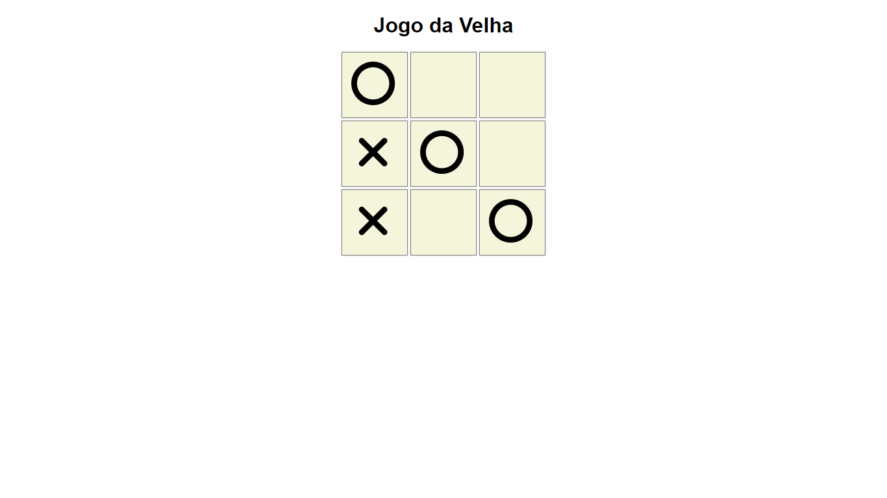
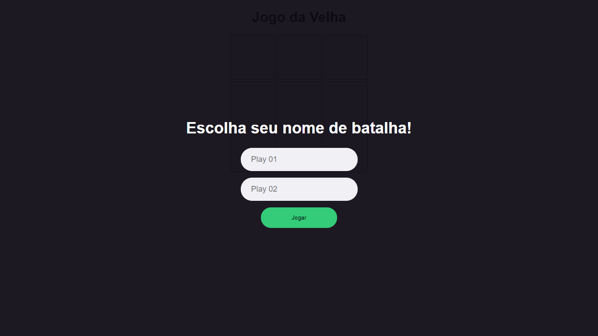

  <h1 align="center">
    Jogo da velha
  </h1>

  

  

_________

### 🤔 Sobre o que se trata ?
Jogo da velha é uma experiência feita em JavaScript. HMTL e CSS com modelo MVC para treinar programação e se divertir. 🤩🤩

### ✨ Sobre o projeto:

Jogo da velha é um joguinho criado para aprender a programar de forma divertida e eficaz, esse projeto esta no inicio, você pode pegar e fazer alteração, mudar tudo e se divertir com o que você vai criar

<h2 align="center"> 📷 Screenshot do jogo: </h2>

# [Uso]()

## Desenvolvimento

Para corrigir um bug ou melhorar um módulo existente, siga estas etapas:

- Garfo o repo
- Criar um novo ramo (`git checkout -b improve-feature`)
- Faça as alterações apropriadas nos arquivos
- Adicione alterações para refletir as alterações feitas
- Comprometa suas alterações (`git commit -am 'Improve feature'`)
- Empurre para o ramo (`git push origin improve-feature`)
- Crie uma solicitação de atração

# Construído com:
- [HTML](#) - HTML é uma linguagem de marcação utilizada na construção de páginas na Web.

- [CSS](#) - Cascading Style Sheets é um mecanismo para adicionar estilo a um documento web.

- [JAVASCRIPT](#) - JavaScript é uma linguagem de programação interpretada estruturada, de script em alto nível com tipagem dinâmica fraca e multiparadigma.

________

  | 
  ---|---
[Perfil Github ](https://github.com/iharsh234) |[Perfil Linkedin](https://www.quandl.com)

